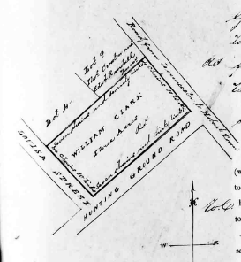
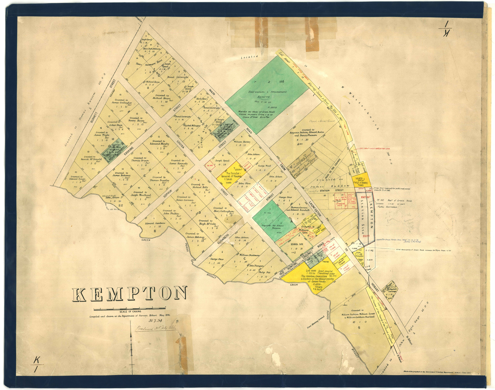
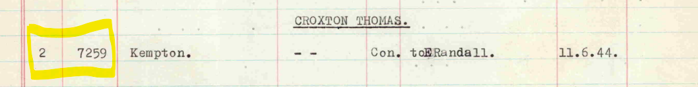
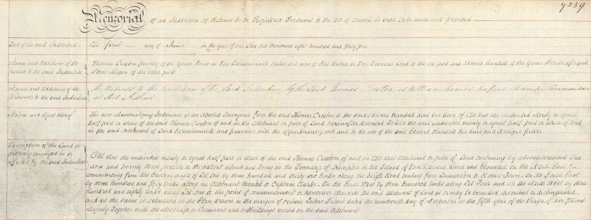

```{r setup, include=FALSE}
knitr::opts_chunk$set(echo = TRUE)
```

## Introduction

The Tasmanian Land Records (1832-1935) dataset contains over 23,000 records relating to deeds of land grants under General Law, which is a system of land title based on common law used up to 1862 in Tasmania.

The Land records dataset, each record contains links to digital objects available at the Tasmanian Names Index held and maintained at Libraries Tasmania (Tasmania n.d.). The nature of these links is as follows:

1.  The URL of the person in the Names Index, which then links to the next two URLS listed here,
2.  The URL to the index page containing the index record,
3.  The URL of the digitised image of the deed of land grant relating to that record.

The area of interest for this project is the location of Kempton, which was previously known as Green Ponds, in the Southern Midlands of Tasmania.

## Results

For the 55 records relating to Kempton, there were 54 unique images downloaded from the Libraries Tasmania website, as described in the Research Methodology for Task 1. One image was repeated due to the land being owned in partnership. ( i.e. Thomas Croxton and Edward Randall were joint owners, so there is one record for each person, linking to the same image.)

One record had blank year information, this was visually checked on the deed image, and confirmed as missing. 'missing' was entered into this cell in the data entry phase.

Not all images had monetary values included, and the format of the document changed over the years.

Only one image had a useful diagram in the margin (Figure 1).

<center>



</center>

Many of the historic deed images relate to parcels of land shown in Figure 2 and it would be useful to use QGIS to link the images to the map locations.

<center>

{width="800"}

</center>

## Additional Task

Automating the subsequent steps of data collation was beyond the scope of this unit, however they are recorded here for future use. This process will facilitate downloading of historic deeds recording the sale of land in Kempton so that ownership can be traced.

### The Historic Deeds

The Land Information System Tasmania website contains information on historic deeds at <https://www.thelist.tas.gov.au/app/content/property/property-search>

(Note: requires an account to login)

The manual process involved these steps:

-   search for surname and year in the list map site

-   download the index pdf covering the appropriate period

-   search for the correct name, and extract the deed number

-   download the deed and save the image.

as outlined here [Historic Deeds General Law User Guide](https://www.thelist.tas.gov.au/app/content/the-list/help-files/Historic-Deeds/Historic_Deeds_General_Law_guide.pdf)

### Example

-   searching for Croxton and 1842 returns a link to a set of pdfs: 1827-1926_CRO-CRO-1.pdf, 1827-1926_CRO-CRO-2.pdf, 1827-1926_CRO-CRU.pdf

-   the entry for Croxton is in the third pdf, giving a deed number of 02/7259 (see Figure 3).

-   return to the historic deeds website and enter the deed number to download a digitised image (see Figure 4).





# Appendix

## Measurement Conversion

Length:

-   1 foot = 12 inches

-   3 feet = 1 yard (Feet to Metres = multiply by 0.3048)

-   1 chain = 22 yards

-   10 chains = 1 furlong

-   100 links = 1 chain

-   1 mile = 8 furlongs

-   1 link equals 0.2 metres (Links to Metres = multiply by 0.2012)

Area:

-   40 perches equals 1 rood

-   4 roods equals 1 acre

-   1 acre equals 0.4 hectares (Acres to Hectares = multiply by 0.404686)

(Source: [Historic Deeds General Law User Guide](https://www.thelist.tas.gov.au/app/content/the-list/help-files/Historic-Deeds/Historic_Deeds_General_Law_guide.pdf))
