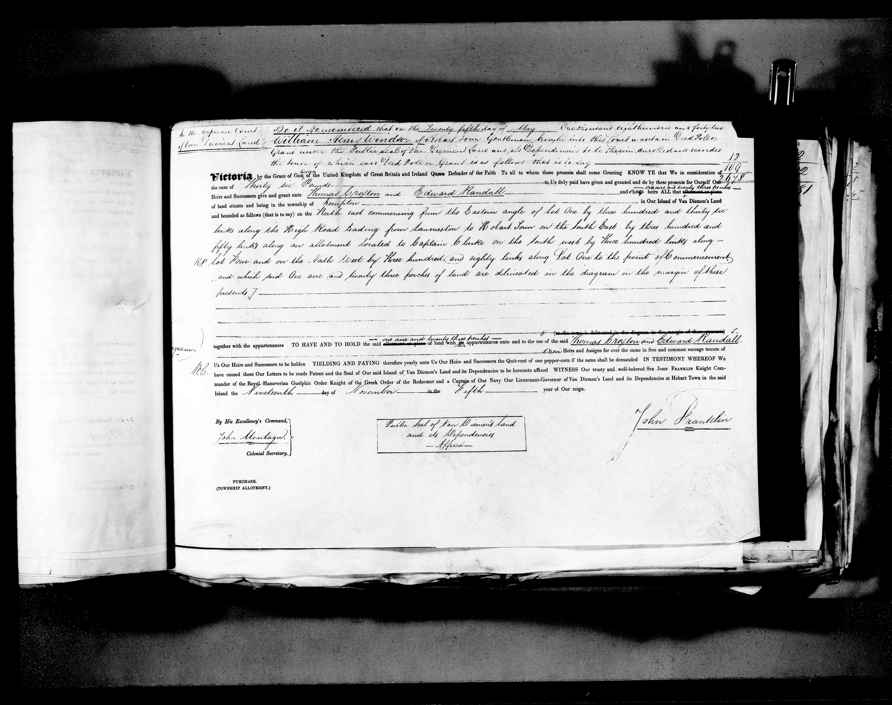
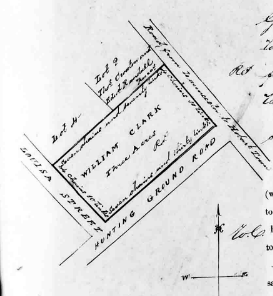
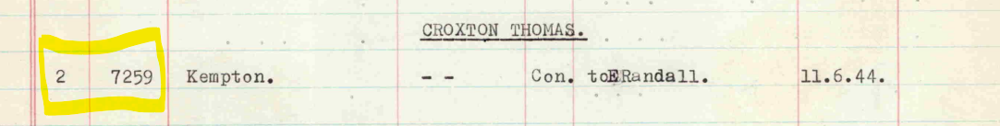
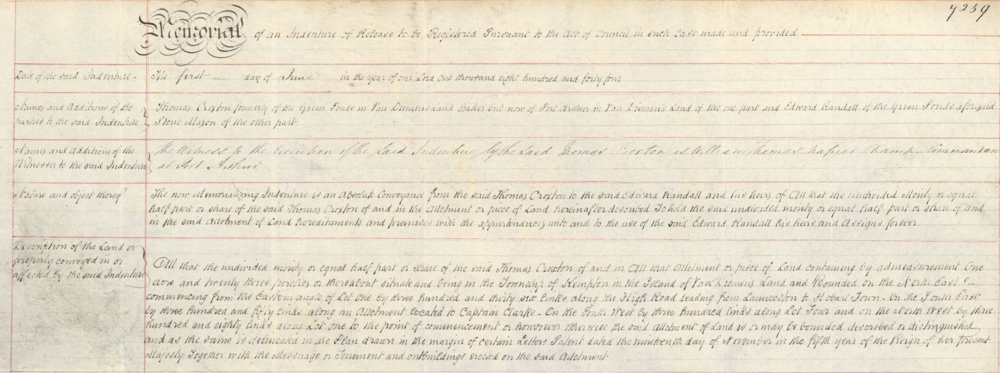

```{r setup, include=FALSE}
knitr::opts_chunk$set(echo = TRUE)
```

## Introduction

The Tasmanian Land Records (1832-1935) dataset contains over 23,000 records relating to deeds of land grants under General Law, which is a system of land title based on common law used up to 1862 in Tasmania.

The Land records dataset, each record contains links to digital objects available at the Tasmanian Names Index held and maintained at Libraries Tasmania [@tasmania]. The nature of these links is as follows:

1.  The URL of the person in the Names Index, which then links to the next two URLS listed here,
2.  The URL to the index page containing the index record,
3.  The URL of the digitised image of the deed of land grant relating to that record.

The area of interest for this project is the location of Kempton, which was previously known as Green Ponds, in the Southern Midlands of Tasmania.

## Method

### Original Dataset

The Tasmanian Land Records (1832 - 1935) dataset was downloaded in CSV format and saved as land.csv

### Open Refine

The original dataset was opened in Open Refine and the following steps were performed:

1.  Check for the location of Kempton, and verify that the earlier name of Green Ponds was not used, and that there were no misspellings for Kempton using 'text facets'.

2.  Filter for Location=Kempton using 'text facets'. This reduced the dataset to 55 records.

3.  Check that each column had data, using 'text facets' to check for blanks.

4.  The URL fields contained combined links, so 'Edit Column \> Split into several columns' was used to separate the columns into meaningful data as follows:

    +---------------------------+---------------------+-----------------------------+
    | Original Column           | Separator Character | New Columns                 |
    +===========================+=====================+=============================+
    | DIGITAL_OBJECT - URL_TEXT | \|                  | DIGITAL_OBJECT - URL_TEXT 1 |
    |                           |                     |                             |
    |                           |                     | DIGITAL_OBJECT - URL_TEXT 2 |
    +---------------------------+---------------------+-----------------------------+
    | DIGITAL_OBJECT - URL      | \|                  | DIGITAL_OBJECT - URL 1      |
    |                           |                     |                             |
    |                           |                     | DIGITAL_OBJECT - URL 2      |
    +---------------------------+---------------------+-----------------------------+
    | NAME                      | ,                   | LASTNAME                    |
    |                           |                     |                             |
    |                           |                     | FIRSTNAME                   |
    +---------------------------+---------------------+-----------------------------+
    | FIRSTNAME                 | \<space\>           | FIRSTNAME1                  |
    |                           |                     |                             |
    |                           |                     | FIRSTNAME2                  |
    +---------------------------+---------------------+-----------------------------+

Three records contained two firstnames, however, since this did not aid in identification of duplicates, the column was split using the space as a separator, and the second firstname was ignored.

The column DIGITAL_OBJECT - URL 2 contained a link to a URL on the Libraries Tasmania website which showed an image viewer, and the relevant image embedded into the viewer. For example the URL for the land grant for Thomas Croxton is:

[https://stors.tas.gov.au/RD1-1-12\$init=RD1-1-12P110JPG](https://stors.tas.gov.au/AD956-1-1$init=AD956-1-1-00129%7Chttps://stors.tas.gov.au/RD1-1-12$init=RD1-1-12P110JPG)

Inspection of the html code using Firefox revealed that the direct link to the image file without the image viewer frame was:

<https://stors.tas.gov.au/fetch/RD1-1-12P110JPG>

So the column DIGITAL_OBJECT - URL 2 was split, using a separator of '=' to isolate the image name required (i.e. RD1-1-12P110JPG). The column was renamed 'IMAGE'.

The data file was saved as refined-land-csv-May-1.csv' in the folder for Portfolio Task 1.

### Download Images from Libraries Tasmania Website

A Python script was developed to iterate (loop over) the rows of the dataset, and for each image listed, web scraping was used to retrieve the image file and save it with a file extension of .jpg to a subfolder named 'captured-grant-images' [@velásquez2021][@pandasr][@maheshwari] .

The LASTNAME and FIRSTNAME1 were added to the filename created in the python script to aid readability of the image list.

The python script is located in the file 'capture-images.py' in the folder for Portfolio Task 1.

An example of the digitised land record image is shown in Figure 1.



\newpage

### Data Entry

The .csv file created in the previous step was opened in Excel and saved in Excel format as 'data-entry.xlsx'

New columns were added to allow data entry of information transcribed from the digital image, as described in the data schema in ReadMe.Rmd

-   SUM_POUNDS

-   SUM_SHILLINGS

-   SUM_PENCE

-   BOUNDARY

-   DIAGRAM

### Data Validation

Data Validation was enabled for the DIAGRAM column to allow values of 'yes' or 'no'.

### Transcription in Tropy

Tropy was used to transcribe the boundary description text for each image, which was then pasted into the data-entry.xlsx spreadsheet.

## Results

For the 55 records, there were 54 unique images. One image was repeated due to the land being owned in partnership. ( i.e. Thomas Croxton and Edward Randall were joint owners, so there is one record for each person, linking to the same image.)

One record had blank year information, this was visually checked on the deed image, and confirmed as missing. 'missing' was entered into this cell in the data entry phase.

Not all images had monetary values included, and the format of the document changed over the years.

Only one image had a useful diagram in the margin.



do something creative to visualise the data - stats by name, year, value?

## Additional Task

Automating the subsequent steps of data collation was beyond the scope of this unit, however they are recorded here for future use. This process will facilitate downloading of historic deeds recording the sale of land in Kempton so that ownership can be traced.

### The Historic Deeds

The Land Information System Tasmania website contains information on historic deeds at <https://www.thelist.tas.gov.au/app/content/property/property-search>

(Note: requires an account to login)

The manual process involved these steps:

-   search for surname and year in the list map site

-   download the index pdf covering the appropriate period

-   search for the correct name, and extract the deed number

-   download the deed and save the image.

as outlined here [Historic Deeds General Law User Guide](https://www.thelist.tas.gov.au/app/content/the-list/help-files/Historic-Deeds/Historic_Deeds_General_Law_guide.pdf)

### Example

-   searching for Croxton and 1842 returns a link to a set of pdfs: 1827-1926_CRO-CRO-1.pdf, 1827-1926_CRO-CRO-2.pdf, 1827-1926_CRO-CRU.pdf

-   the entry for Croxton is in the third pdf, giving a deed number of 02/7259 (see Figure 2).

-   return to the historic deeds website and enter the deed number to download a digitised image (see Figure 3).





\newpage

# Appendix

## Measurement Conversion

Length:

-   1 foot = 12 inches

-   3 feet = 1 yard (Feet to Metres = multiply by 0.3048)

-   1 chain = 22 yards

-   10 chains = 1 furlong

-   100 links = 1 chain

-   1 mile = 8 furlongs

-   1 link equals 0.2 metres (Links to Metres = multiply by 0.2012)

Area:

-   40 perches equals 1 rood

-   4 roods equals 1 acre

-   1 acre equals 0.4 hectares (Acres to Hectares = multiply by 0.404686)

(Source: [Historic Deeds General Law User Guide](https://www.thelist.tas.gov.au/app/content/the-list/help-files/Historic-Deeds/Historic_Deeds_General_Law_guide.pdf))

# References
