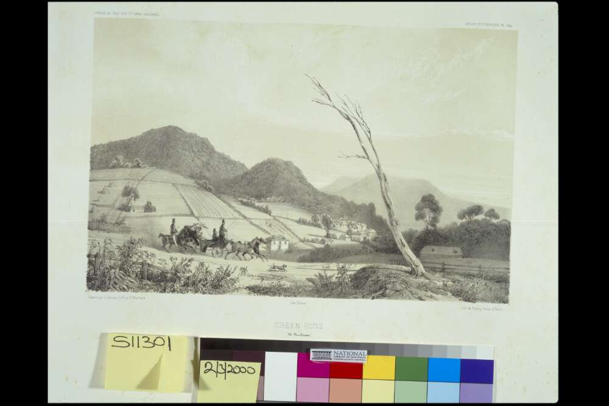
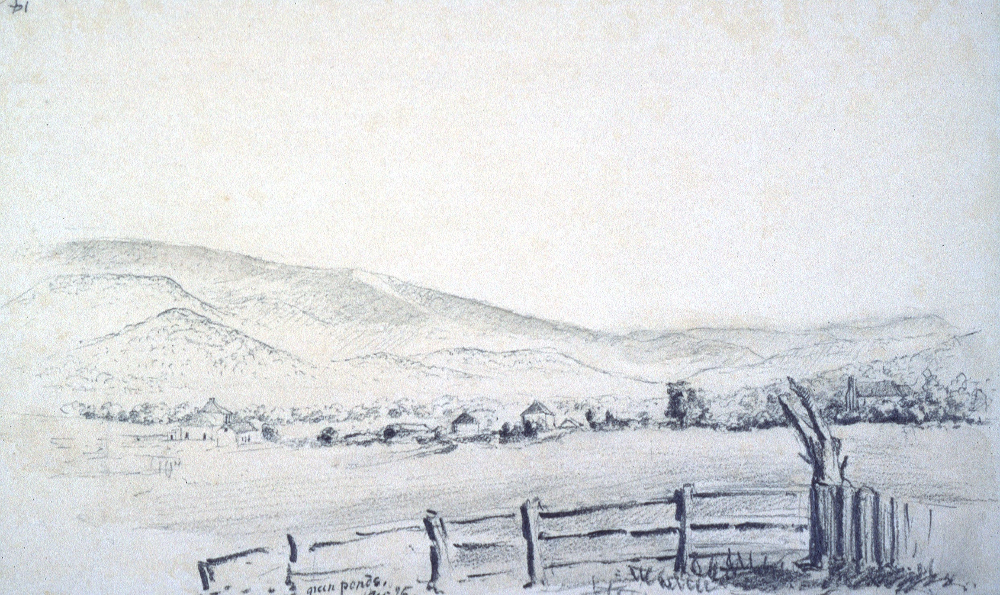
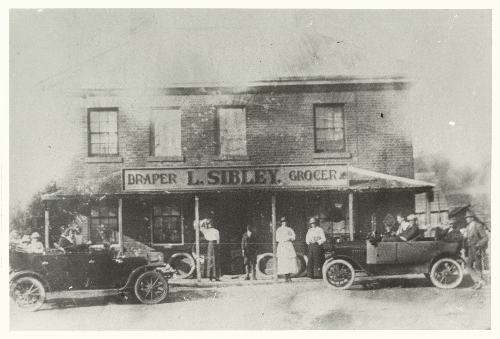
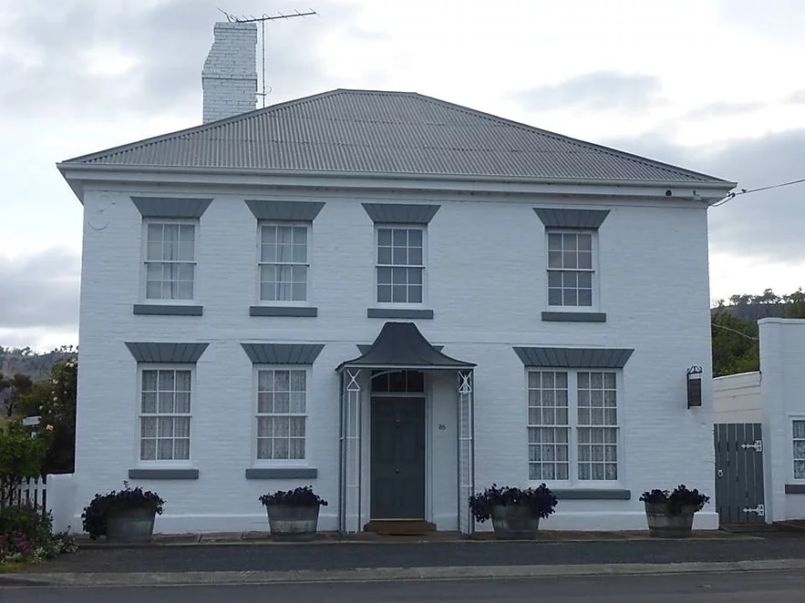
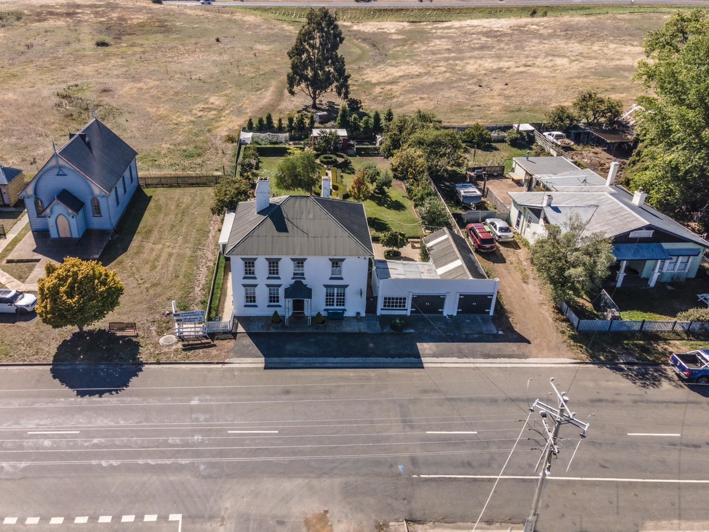
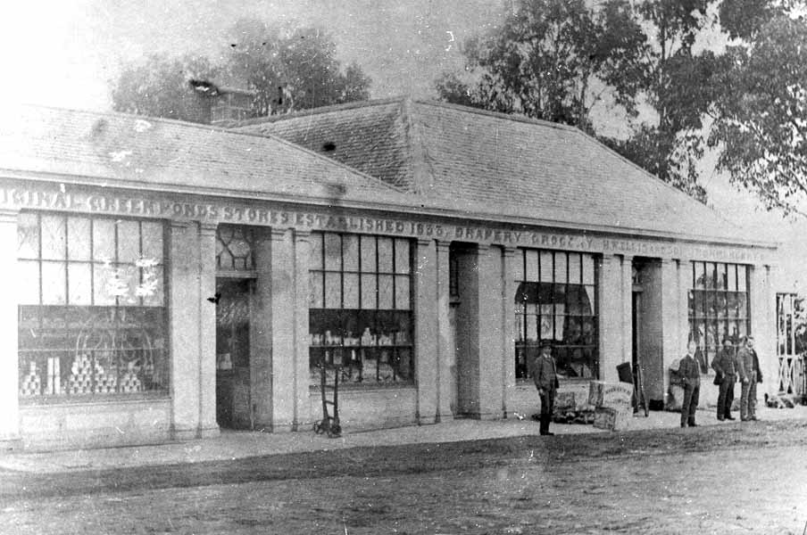
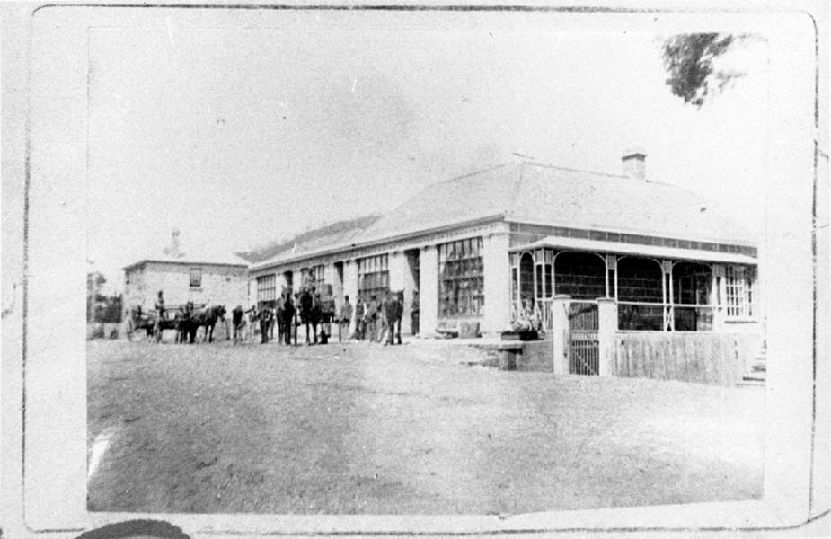
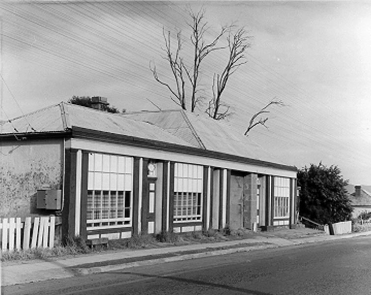
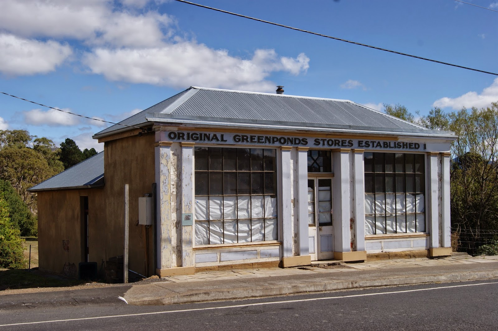

```{r setup, include=FALSE}
knitr::opts_chunk$set(echo = TRUE)
```

## Visual Presentation

The images selected for the visual presentation were chosen because they represent an historical overview of Green Ponds / Kempton from a small coaching stopping point on the road to Launceston through an expansion in the 1840s when many Georgian style buildings were constructed to the small town existing today.

Many of the images do not have any people in them, as the focus is primarily buildings and architecture, however those that do, illustrate the changes in fashion over time, with most people wearing fairly formal attire (coats or long dresses) and the majority wearing hats. Evident also, is the change in infrastructure such as paved roads, kerbs and footpath and electricity power-lines that were introduced in the modern era.

### Beginnings

Before the invention of photography, we must rely on visual media such as drawings and paintings for an assessment of how things looked. These three artworks show the small beginnings of the settlement at Green Ponds.

Link to Source data: [Beginnings Zotero Report](/data/zotero-report-beginnings.pdf)





### 86 Main Street, Kempton

The series of photos of the property at 86 Main Street illustrates the heritage of the buildings in the town of Kempton. The property was used for decades as a store selling drapery and groceries, and was something of a town landmark, hence the earlier photos with people arranged outside. Finer details such as the road construction, kerbing, footpaths and so on can also be examined across the time period of the images. At a later time, the property was converted to a private residence, and renovated. Even though the exterior is painted white, the original architectural features and decorations are still evident. Described as 'Georgian style residence' built in the 1840s, when put up for sale in 2021, it sold for \$715,000 as a prestige residence (86 Main Street Kempton, TAS 7030 - House for sale - 3NFNFCS n.d.).

Link to Source data: [Highfield House Zotero Report](/data/zotero-report-highfield-house.pdf)

![86 Main Street Kempton - Lumsden Drapery c. 1900 (*Draper's Shop, Kempton [now Highfield House, 86 Main Street Kempton]* 1900)](images/PH30-1-7740.jpg)







### Ellis's Store

The 'Original Green Ponds Stores' is situated at Main Street, Kempton. It was established in 1833 by William Henry Ellis (as per the lettering on the building) however it is likely the building in the photos was built c. 1840. Ellis also built Dysart House in the same time period. WH Ellis expanded the building in 1852 with extension having a taller roof-line than the original building. After his death, the store continued under the ownership of his sons (hence the lettering change to H.W. Ellis). A fire in 1966 destroyed the 1852 addition leaving a much smaller building, which has been partially restored.

The earlier two photos of the store provide an illustration of clothing styles of the time, transportation methods (horse and cart), and glimpses into the operation of a general store via the cans stacked as a display in the window and the wooden crates outside the store.

Link to Source data: [Ellis Zotero Report](/data/zotero-report-ellis.pdf)









## References

86 Main Street Kempton, TAS 7030 - House for sale - 3NFNFCS (n.d.) LJ Hooker Pinnacle Property, <https://pinnacleproperty.ljhooker.com.au/house-in-kempton-tas-7030-au-3nfnfcs>, accessed 19 May 2022.

Blanchard P (1841) Green-Pons, Ile Van Diemen [picture], <https://nla.gov.au/nla.obj-136478027>, accessed 5 May 2022.

Draper's Shop, Kempton [now Highfield House, 86 Main Street Kempton] (1900), <https://stors.tas.gov.au/PH30-1-7740>, accessed 5 May 2022.

Ellis' Commercial Store (1960), <https://stors.tas.gov.au/PH30-1-301>, accessed 5 May 2022.

HW Ellis' store, Kempton (1880), <https://stors.tas.gov.au/PH30-1-9149>, accessed 5 May 2022.

L Sibley's grocer and drapery store, Kempton - cars and people in forground (n.d.), <https://stors.tas.gov.au/PH30-1-9154>, accessed 5 May 2022.

Mansfield JW (1844) Green Ponds Nov 26, <https://stors.tas.gov.au/ILS/SD_ILS-606605>, accessed 5 May 2022.

Photograph - Ellis General Store, Main Street, Kempton (1900), <https://stors.tas.gov.au/PH30-1-7742>, accessed 30 May 2022.

Ritchie G (2015) 'On The Convict Trail: Green Ponds Store, Kempton', On The Convict Trail, <http://ontheconvicttrail.blogspot.com/2015/03/green-ponds-store-kempton.html>, accessed 30 May 2022.
