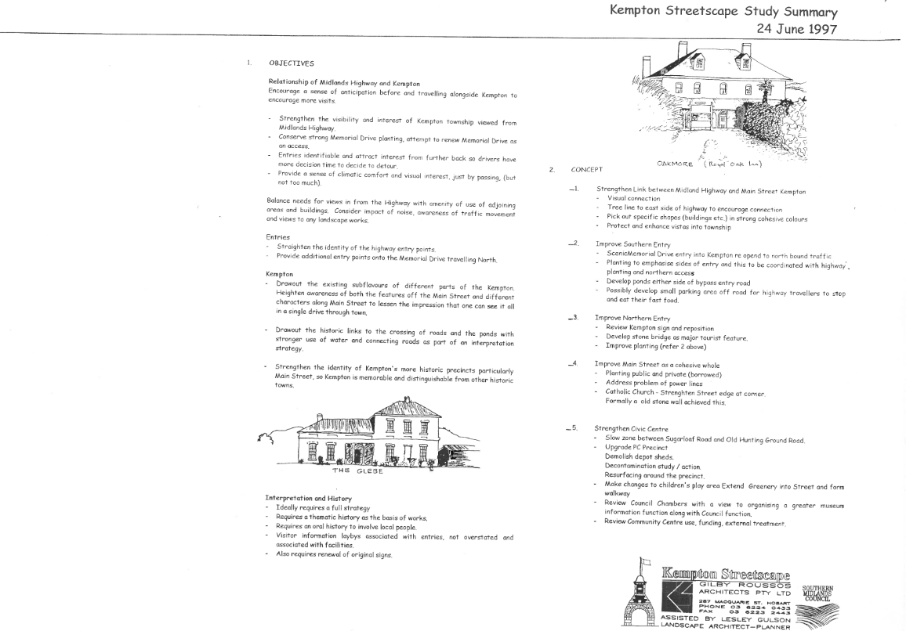

```{r setup, include=FALSE}
knitr::opts_chunk$set(echo = TRUE)
```

## Codes and Themes

While using Taguette proved difficult with this selection of documents due to the incorrect formatting of multi-column pages into one merged column, nevertheless certain themes became evident during the coded analysis.

The codes used in the Taguette analysis mainly related to 'heritage strategy' and 'Kempton'. It became apparent during the coding process that 'horse drawn heritage' was a prominent theme, and a code was added for this. References to the Kempton streetscape, tourism, and the Heritage Highway also required codes to be added.

In the heritage strategy in use by the Southern Midlands Council, the town of Oatlands takes priority financially, and in the number of heritage projects receiving attention. Kempton being the next largest two in the Local Government Area receives substantially less attention, but still more that the other towns in the area.

In the Southern Midlands Council Historic Heritage Strategy 2014-2018 report, there is mention of 'special planning provisions for properties within Historic Precinct Special Areas (HPSA). These are designated areas within the centre of Oatlands, Kempton and Campania, as well as the 'Heritage Mile' at Mangalore' however in later reports these special areas are not mentioned except for the Heritage Precinct in Oatlands. Under the heading of 'Proposed expanded and new Heritage Areas' in the 2014-2018 report it is envisaged that the change will be 'Reducing the heritage precinct at Kempton, slightly'

In Kempton, the priorities are the streetscape, 'horse drawn' heritage, and the Kempton Watchhouse, which is a focus for restoration and a symbol/logo of the town.

Horse-drawn Heritage relating to Kempton is a signicant heritage project that gains a lot of attention and funding. It is discussed in all the documents analysed, with regards to the collection of carriages and memorabilia and the funding of a building to store the collection. In the 2009-2010 Annual Report \$45,000 is granted for 'The design and construction of a home for the horse drawn carriages at Kempton', and in the Southern Midlands Council Historic Heritage Strategy 2019-2023 report it is noted that ' A purpose-built faculty has been constructed on the property adjoining the Kempton Recreation ground and a part of the collection is stored and displayed in that building'.

The Heritage Highway is an important heritage concept across the whole of the Southern Midland area, however the visitor centre is located in Oatlands, and does not receive as much focus in Kempton.

Design guidelines for the Georgian buildings in Kempton and Oatlands were developed in the 2014-2018 Heritage Strategy Report, however these are not mentioned in the 2019-2013 document.

There is a heavy reliance on volunteers in the Southern Midlands to assist with heritage projects, and these were noted in particular in the Annual Report where it warranted a section in the table of contents. For example: 'Many initiatives of Council's Heritage Projects Program benefit from volunteers' (2009-2010) and 'The value of Volunteers in our community cannot be under estimated' (2020-2012).

Some of the projects identified in the earlier 1997 streetscape proposal (which was evaluated manually due to difficulties with Taguette) such as the heritage plaques, and tree planting have been implemented, however many have not, as shown in the following examples of items and relevant discussion from the 1997 streetscape proposal:

-   Sugarloaf Hill was proposed as a possible look out site - it is not mentioned in any of the documents analysed in Taguette,

-   Ellis Precinct, restore the shop - no mention of Ellis in any other document. It should be noted that the Ellis store had experienced sever damage by fire at this point, and was in a bad state of repair. This is illustrated further in Portfolio Task 2 - Image Analysis.

<center>

{width="800"}

</center>

## Significance

The categorisation and coding of data from text documents can be done fairly quickly using digital tools such as RStudio to convert pdf documents to text, and Taguette to highlight, tag and analyse that text. However the simple methods used here were not sophisticated enough to cope with the multi-column format of the reports used. This made analysis difficult, but not impossible as the original formatted report could be open side-by-side with Taguette to ensure the context was not lost.

The overwhelming focus of Heritage Strategy reports under the Southern Midland Council is on Oatlands. In the 2019-2023 report, in the section titled Heritage Projects, there is only one that is specific to Kempton - the Green Ponds Watch House project.

Heritage Tourism plays a vital part in the community and economy of the town of Kempton as recognised in the 2019-2023 report: 'Whilst it is obvious that the Southern Midlands has a wealth of historic cultural heritage sites, both privately and publicly owned, which have the potential to be integrated into tourism initiatives, a strategic approach to the promotion and interpretation of these sites is required'.
