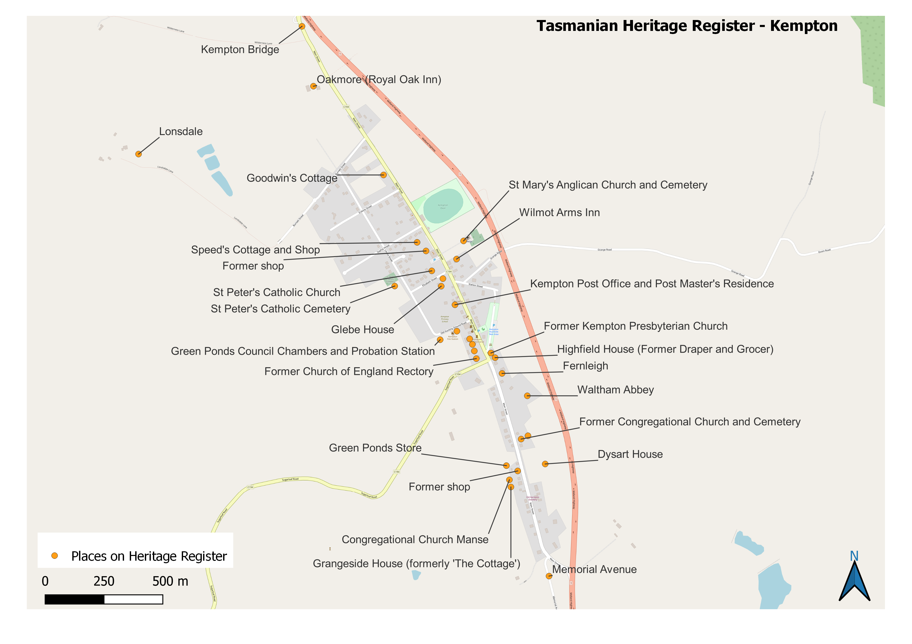
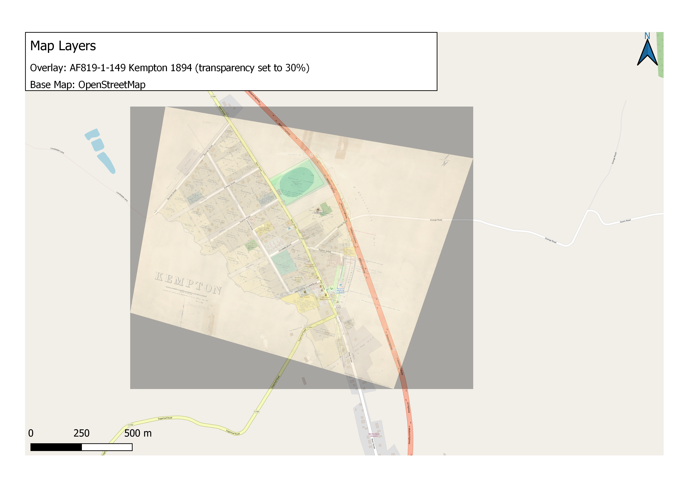

```{r setup, include=FALSE}
knitr::opts_chunk$set(echo = TRUE)
```

## Kempton Location

The map used in Figure 1 of Research and Design was created using QGIS and the following layers:

-   Ausmap plugin - Local Government Areas

-   ARCGIS REST server - <http://services.ga.gov.au/gis/rest/services/NM_Labelling_and_Boundaries/MapServer> with the following layers activated:

    -   ausvgd_l

    -   aus5lgd_p

    -   aus10wgd_r

    -   aus10gdg_l

    -   Coastline_250K_Scale

A Print Layer was created showing the location of Kempton relative to the main cities of Tasmania, within the Souther Midlands Local Government Area.

Additional tasks were undertaken within the GIS Mapping module to produce the following maps.

## Heritage Places

[Link to clickable map](/web-map/clickable-map.html)

<center>

{width="800"}

</center>

## Georeferencing a Map

<center>

{width="800"}

</center>
