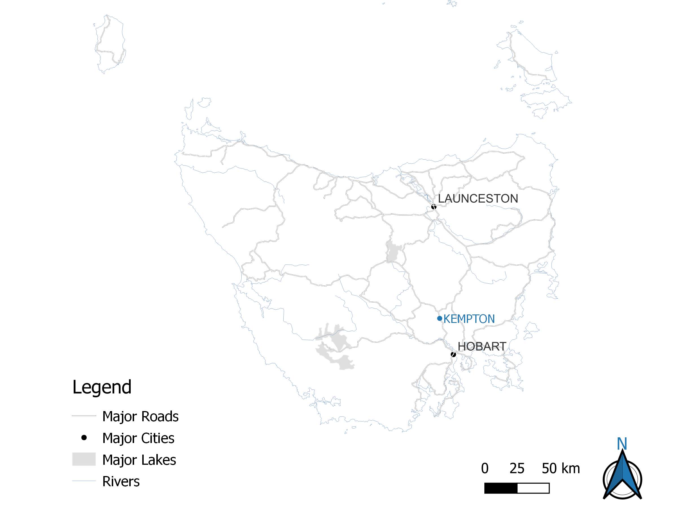

```{r setup, include=FALSE}
knitr::opts_chunk$set(echo = TRUE, fig.pos = "!H")
```

# Research Design

## Introduction

The question explored through this portfolio is:

> *What is the contribution of research in the digital humanities to the production and dissemination of public 'stories' or interpretations about aspects of local community history and cultural heritage? Drawing on a series of related case studies, illustrate how these tools and methods can aid historical scholarship.*

The series of related case studies used to illustrate tools and methods in Digital Humanities centres around the historic town of Kempton in the Southern Midlands district of Tasmania.

## Background

The town of Kempton is located approximately fifty kilometers north of Hobart, on the Midland Highway. It was first settled by Europeans in 1820, and was known as Green Ponds until 1895 when the name was officially changed to Kempton after Anthony Kemp, the first landholder in the area.[^1]

[^1]: <https://www.utas.edu.au/library/companion_to_tasmanian_history/K/Kempton.htm>

image should be here

{width="351"}

a background section that contextualises and explains the focus of your research, including case study locality, local historical context, previous relevance historical, archaeological or heritage studies, and other information that helps the reader to understand your focus in this assignment (Note: this is a good location to include the GIS map you create

## Research Methodology

overview of methodology

brief comment on major approaches used to complete the portfolio tasks

### Task 1 - Harvesting Data From the Web

This task uses the Tasmanian Land Records (1832-1935) dataset filtered to only include records from Kempton. Images of the deeds were downloaded via a URL in the dataset from the Tasmanian Names Index held and maintained at Libraries Tasmania. Additional data was transcribed and added to the task dataset.

### Task 2 - Historical Image Analysis

This task curates a digital repository of publicly available audio-visual data relevant to Kempton.

### Task 3 - Thematic Coding

This task involved the application of a qualitative coding methodology on unstructured text.

### Task 4 - Mapping the Data

This task was to create a digital map incorporating spatial data of relevance to the research question. The aim was to produce a map of the locality that this assignment focuses on.
