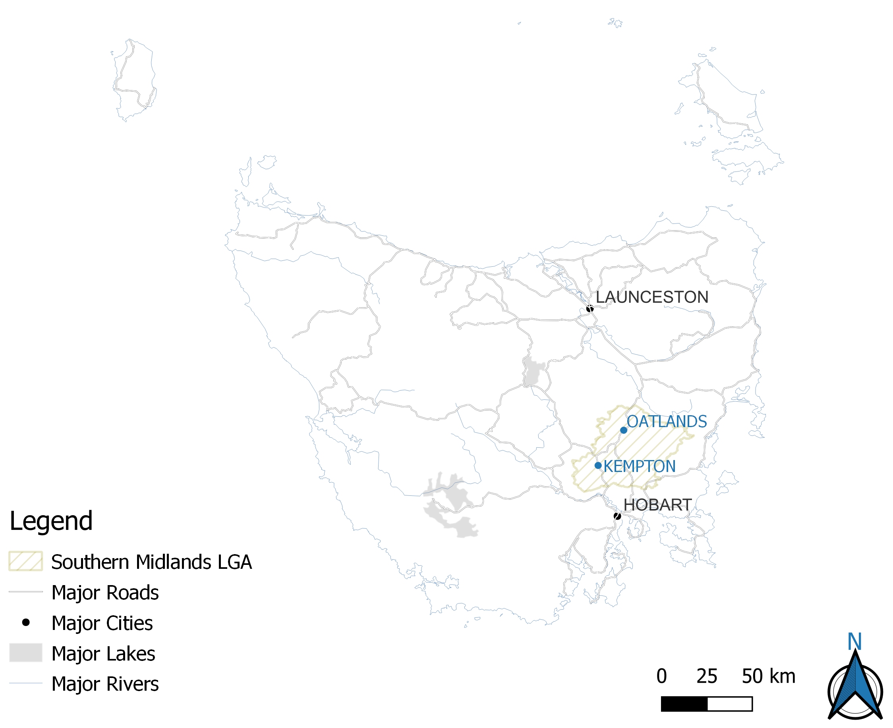

```{r setup, include=FALSE}
knitr::opts_chunk$set(echo = TRUE, fig.pos = "!H")
```

# Research Design

## Introduction

The question explored through this portfolio is:

> *What is the contribution of research in the digital humanities to the production and dissemination of public 'stories' or interpretations about aspects of local community history and cultural heritage? Drawing on a series of related case studies, illustrate how these tools and methods can aid historical scholarship.*

A series of related case studies relating to heritage in the historic town of Kempton, Tasmania has been used to illustrate tools and methods in Digital Humanities.

## Background

The town of Kempton is located approximately fifty kilometres north of Hobart, on the Midland Highway in the Local Government Area of Southern Midlands (as shown on Figure 1). It was first settled by Europeans in 1820, and was known as Green Ponds, then Kemp Town, until 1866 when the name was officially gazetted as Kempton after Anthony Kemp, the first landholder in the area [@placenam].

Anthony Kemp was granted land at Green Ponds in 1816, and in the following years other settlers took up land grants for farming. The township developed, including several inns and churches.

In 1828 the Green Ponds Probation Station was established, located on the Green Ponds glebe, and housed many convict road parties working on building the road between Hobart and Launceston. The Probation station was closed in 1841, and following this, the land associated with the glebe was sold. Subsequently, many buildings were constructed in the 1840s [@history]. These buildings were built in classic Georgian style, and form an important part of the heritage of the town of Kempton.

The local government area of Southern Midlands has a number of towns with historic buildings and heritage areas, including Oatlands, Kempton, Colebrook and Jericho [@southern]. Oatlands is a major historical centre, with a large collection of Georgian sandstone buildings, the iconic Callington Mill and tends to draw the focus for heritage and historical projects in the region, as evident on the council website where five of the major heritage projects listed are at Oatlands [@heritagea] .



\newpage

Heritage projects relating to Kempton recently undertaken include:

-   The restoration of the Kempton Watch House, which is the remains of the original probation station, and now part of the council offices [@kempton].

![Kempton Watch House [@greenpo2015]](images/kempton-watch-house.jpg){height="200"}

-   A 'Re-living the Past' festival in 2009 focusing on the horse-drawn heritage of Kempton as a coaching village - with two building linked to early coacj services between Hobart and Launceston [@horsedra].

-   'Shadows of the Past' on the Heritage Highway - there are sixteen large metal silhouettes located on the highway between Kempton and Tunbridge forming a sculpture trail [@shadows]. The four sculptures close to or in Kempton all relate to horse drawn coaches.

![Silhouette sculpture [@greenpo2015]](images/silhouette-sculpture.jpg)

Community groups of relevance to this project are the Green Ponds Progress Association, whose aim is to raise the profile and opportunities within Kempton and the Green Ponds District [@greenpo2015] and the Oatlands Community Association [@oatlands].

## Research Methodology

The research methodology used in this project is founded on the principles of reproducible research and FAIR data which are further discussed (in the discussion and conclusions section).

The major approaches used to complete the portfolio tasks are briefly discussed in the following sections.

### Task 1 - Harvesting Data From the Web

This task uses the Tasmanian Land Records (1832-1935) dataset filtered to only include records from Kempton. Images of the historic deeds were downloaded, via a URL in the dataset, from the Tasmanian Names Index which is held and maintained at Libraries Tasmania. Additional data was transcribed and added to the task dataset. The data collated for this task can be used as a foundation for further examination of ownership of land in the Kempton townsite since the 1840s.

### Task 2 - Historical Image Analysis

This task curates a digital repository of publicly available audio-visual data relevant to Kempton. The focus for this task was a series of historical photos and paintings of Kempton and comparing more recent photographs with a view to assessing the preservation of heritage.

### Task 3 - Thematic Coding

This task involved the application of a qualitative coding methodology on unstructured text. The focus for this task was Heritage Strategy Reports from the Southern Midlands council. The reports analysed using Taguette were :

-   Kempton Streetscape Study 1997

-   Southern Midlands Council Historic Heritage Strategy 2013-2018

-   Southern Midlands Council Historic Heritage Strategy 2019-2023

-   Annual Report 2009-2010

-   Annual Report 2020-2021 with Financials

The Streetscape Study, although in pdf format, could not be read by Taguette so was converted to text using the zotero-corpus-creator.R script provided in the unit.Due to the large amount of stylistic writing and diagrams, this document proved inadequate for thematic coding using Taguette.

The Annual Report 2009-2010, although in pdf format, could not be read by Taguette so was converted to text using the zotero-corpus-creator.R script provided in the unit.

Both Heritage Strategy reports could be read by Taguette, however there were formatting issues, especially in documents with multiple columns, so the thematic coding for all documents was done with a copy of the original report open to compare. Taguette was difficult to use in these circumstances as the text displayed in Taguette was not a true reflection of the text layout in the original documents as illustrated in the following images..


### Task 4 - Mapping the Data

The aim of this task was to produce a map of the locality that this assignment focuses on, with optional additional tasks. The map at Figure 1 on this page was produced in this task, as well as an interactive map of heritage sites in Kempton, and an overlay of xx map on the current town layout.

## References
