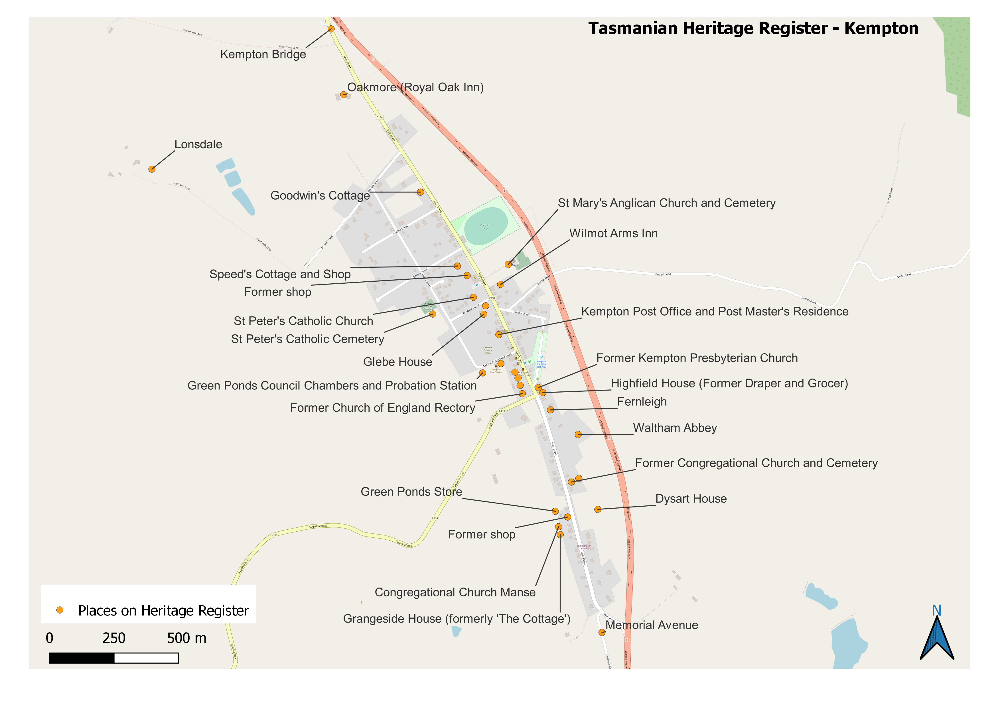
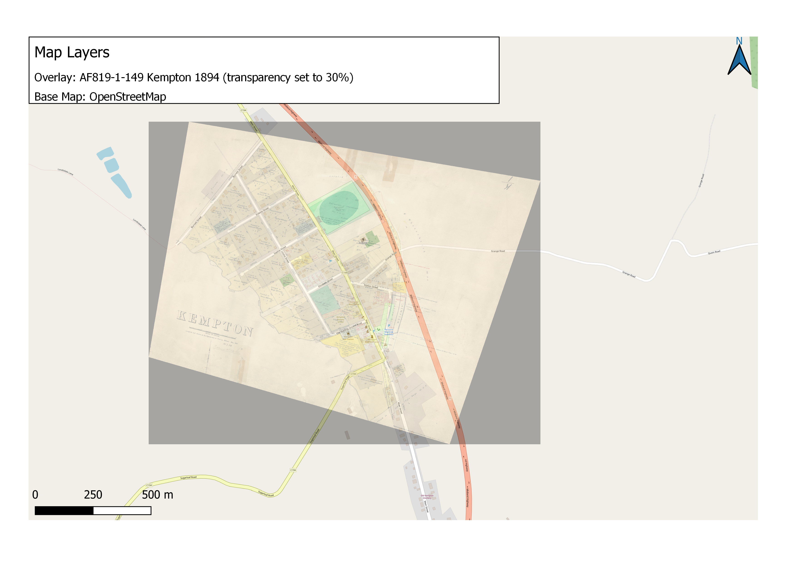

```{r setup, include=FALSE}
knitr::opts_chunk$set(echo = TRUE, fig.pos = "!H")
```

## Introduction

The question explored through this portfolio is:

> *What is the contribution of research in the digital humanities to the production and dissemination of public 'stories' or interpretations about aspects of local community history and cultural heritage? Drawing on a series of related case studies, illustrate how these tools and methods can aid historical scholarship.*

A series of related case studies relating to heritage in the historic town of Kempton, Tasmania has been used to illustrate tools and methods in Digital Humanities.

## Background

The town of Kempton is located approximately fifty kilometres north of Hobart, on the Midland Highway in the Local Government Area of Southern Midlands (as shown on Figure 1). It was first settled by Europeans in 1820, and was known as Green Ponds, then Kemp Town, until 1866 when the name was officially gazetted as Kempton after Anthony Kemp, the first landholder in the area (Placenames Tasmania n.d.).

Anthony Kemp was granted land at Green Ponds in 1816, and in the following years other settlers took up land grants for farming. The township developed, including several inns and churches.

In 1828 the Green Ponds Probation Station was established, located on the Green Ponds glebe, and housed many convict road parties working on building the road between Hobart and Launceston. The Probation Station was closed in 1841, and following this, the land associated with the glebe was sold. Subsequently, many buildings were constructed in the 1840s (*Green Ponds Progress Association* 2015). These buildings were built in classic Georgian style, and form an important part of the heritage of the town of Kempton.

The local government area of Southern Midlands has a number of towns with historic buildings and heritage areas, including Oatlands, Kempton, Colebrook and Jericho (*Southern Midlands Council* 2020). Oatlands is a major historical centre, with a large collection of Georgian sandstone buildings and the iconic Callington Mill and tends to draw the focus for heritage and historical projects in the region, as evident on the council website where five of the major heritage projects listed are at Oatlands (*Heritage Projects & Sites* n.d.).

<center>

{width="800"}

</center>

Heritage projects relating to Kempton recently undertaken include:

-   The restoration of the Kempton Watch House, which is the remains of the original probation station, and now part of the council offices (*Kempton Watch House* n.d.).

<center>


</center>

-   A 'Re-living the Past' festival in 2009 focusing on the horse-drawn heritage of Kempton as a coaching village - with two buildings linked to early coach services between Hobart and Launceston (*Horse Drawn Heritage* n.d.).

-   'Shadows of the Past' on the Heritage Highway - there are sixteen large metal silhouettes located on the highway between Kempton and Tunbridge forming a sculpture trail (*Shadows of the Past* n.d.). The four sculptures close to or in Kempton all relate to horse drawn coaches.

<center>


</center>

Community groups of relevance to this project are the Green Ponds Progress Association (*Green Ponds Progress Association* 2015), whose aim is to raise the profile and opportunities within Kempton and the Green Ponds District and the Oatlands Community Association (*Oatlands Community Association* n.d.).

## Research Methodology

The research methodology used in this project is founded on the principles of reproducible research and FAIR data which are further discussed in the discussion and conclusions section.

The major approaches used to complete the portfolio tasks are discussed in the following sections.

### Task 1 - Harvesting Data From the Web

This task uses the Tasmanian Land Records (1832-1935) dataset filtered to only include records from Kempton. Images of the historic deeds were downloaded, via a URL in the dataset, from the Tasmanian Names Index which is held and maintained at Libraries Tasmania. Additional data was transcribed and added to the task dataset. The data collated for this task can be used as a foundation for further examination of ownership of land in the Kempton townsite since the 1840s.

For details of filenames, fields, rules and data schema refer to readMe-task-1.

#### Original Dataset

The Tasmanian Land Records (1832 - 1935) dataset was downloaded in CSV format.

#### Open Refine

The original dataset was opened in Open Refine and the following steps were performed:

1.  Check for the location of Kempton, and verify that the earlier name of Green Ponds was not used, and that there were no misspellings for Kempton using 'text facets'.

2.  Filter for Location=Kempton using 'text facets'. This reduced the dataset to 55 records.

3.  Check that each column had data, using 'text facets' to check for blanks.

4.  The URL fields contained combined links, so 'Edit Column \> Split into several columns' was used to separate the columns into meaningful data as follows:

    +---------------------------+---------------------+-----------------------------+
    | Original Column           | Separator Character | New Columns                 |
    +===========================+:===================:+=============================+
    | DIGITAL_OBJECT - URL_TEXT | \|                  | DIGITAL_OBJECT - URL_TEXT 1 |
    |                           |                     |                             |
    |                           |                     | DIGITAL_OBJECT - URL_TEXT 2 |
    +---------------------------+---------------------+-----------------------------+
    | DIGITAL_OBJECT - URL      | \|                  | DIGITAL_OBJECT - URL 1      |
    |                           |                     |                             |
    |                           |                     | DIGITAL_OBJECT - URL 2      |
    +---------------------------+---------------------+-----------------------------+
    | NAME                      | ,                   | LASTNAME                    |
    |                           |                     |                             |
    |                           |                     | FIRSTNAME                   |
    +---------------------------+---------------------+-----------------------------+
    | FIRSTNAME                 | \<space\>           | FIRSTNAME1                  |
    |                           |                     |                             |
    |                           |                     | FIRSTNAME2                  |
    +---------------------------+---------------------+-----------------------------+

Three records contained two firstnames, however, since this did not aid in identification of duplicates, the column was split using the space as a separator, and the second firstname was ignored.

The column DIGITAL_OBJECT - URL 2 contained a link to a URL on the Libraries Tasmania website which showed an image viewer, and the relevant image embedded into the viewer. For example the URL for the land grant for Thomas Croxton is:

> [https://stors.tas.gov.au/RD1-1-12\$init=RD1-1-12P110JPG](https://stors.tas.gov.au/AD956-1-1$init=AD956-1-1-00129%7Chttps://stors.tas.gov.au/RD1-1-12$init=RD1-1-12P110JPG)

Inspection of the html code using Firefox revealed that the direct link to the image file without the image viewer frame was:

> <https://stors.tas.gov.au/fetch/RD1-1-12P110JPG>

So the column DIGITAL_OBJECT - URL 2 was split, using a separator of '=' to isolate the image name required (i.e. RD1-1-12P110JPG). The column was renamed 'IMAGE'.

The data file was saved as refined-land-csv-May-1.csv' in the folder for Portfolio Task 1.

#### Download Images from Libraries Tasmania Website

A Python script was developed to iterate (loop over) the rows of the dataset, and for each image listed, web scraping was used to retrieve the image file and save it with a file extension of .jpg to a subfolder named 'captured-grant-images' (Velasquez 2021; RStudio IDE Tools for reticulate n.d.; Pandas read_csv() - How to read a csv file in Python - Machine Learning Plus 2021; Maheshwari 2022).

The LASTNAME and FIRSTNAME1 were added to the filename created in the Python script to aid readability of the image list.

The Python script is 'capture-images.py' in the data folder for Portfolio Task 1.

An example of the digitised land record image is shown in Figure 4.

<center>

{width="800"}

</center>

#### Data Entry

The .csv file created in the previous step was opened in Excel and saved in Excel format as 'data-entry.xlsx'

New columns were added to allow data entry of information transcribed from the digital image, as described in the data schema in readMe-task-1

-   SUM_POUNDS

-   SUM_SHILLINGS

-   SUM_PENCE

-   BOUNDARY

-   DIAGRAM

#### Data Validation

Data Validation was enabled for the DIAGRAM column to allow values of 'yes' or 'no'.

#### Transcription in Tropy

Tropy was used to transcribe the boundary description text for each image, which was then pasted into the data-entry.xlsx spreadsheet.

#### Collated Data

The collated data from the finalised version of data-entry.xlsx was exported to portfolio-task-1-collated-data.csv

### Task 2 - Historical Image Analysis

The aim of this task was to curate a visual presentation from a collection of historic images relevant to the case study, following a process of searching for digitised online images, an initial reflection on each image, then a structured reflection in more detail, followed by compilation of the final presentation.

For details of filenames, fields, Tropy files refer to readMe-task-2.

#### Image Selection

Using the keywords listed in Table 1, searches for accessible digitised images were undertaken. Images were selected on the basis of relevance to the theme of heritage in Green Ponds / Kempton.

| Keyword Searches in Groups                                          |
|---------------------------------------------------------------------|
| green ponds , green ponds tasmania, green ponds historical images   |
| ------------------------------------------------------------------- |
| kempton, kempton tasmania, kempton historical images                |
| ------------------------------------------------------------------- |
| historical buildings kempton                                        |
| ------------------------------------------------------------------- |
| Ellis Store kempton, drapery kempton, highfield house kempton       |

: Keywords used for image searches

A total of 57 images were downloaded. The primary sources for images were:

-   Libraries Tasmania archives

-   Green Ponds Progress Association

-   State Library NSW

-   Private websites.

#### Initial Reflection

Zotero was used to manage references, and to add initial reflection notes to all images. The images were then exported to Tropy for further analysis. The title of the image was not imported in the transfer to Tropy so this had to be manually copied to notes. The power of Tropy to sort and manage images was used to categorise and group images. For example, there were several images of the same building taken at different times, so these were categorised under the name of the building. Other categories used were:

-   Panorama photos

-   Sketches

-   People

Following this, twenty images were shortlisted for the structured reflection task, and added to the 'structured reflection' list.

#### Structured Reflection

Note for the structured reflection were added in Tropy, and the images in the 'structured reflection' list were exported to a .csv file using the Tropy CSV Eport plugin (*Export with CSV Export plugin* 2022).

The questions chosen for the structured reflection task were:

1.  What is the context of the image? When and where was it taken?

2.  Is the image spontaneous or staged?

3.  What draws the eye immediately? What are the focal points?

4.  What objects or physical features are in the image? Describe any architectural features.

5.  Are there people? What are they doing? What kinds of facial expressions and body language are evident in the image?

6.  What can be seen in the background? Are there any symbols, landmarks, writing that are part of the image?

7.  What insights does this image provide on the past that we would not have without it?

#### Image Presentation

The images selected for the presentation were chosen to show how aspects of Kempton have changed over time. Source data from Tropy was copied back to Zotero and reports for each group of images were generated in .html format which were linked to in the presentation.

### Task 3 - Thematic Coding

The aim of this task was the application of a qualitative coding methodology on unstructured text. The focus for this task was Heritage Strategy Reports from the Southern Midlands council. The reports analysed using Taguette were :

-   Kempton Streetscape Study 1997

-   Southern Midlands Council Historic Heritage Strategy 2013-2018

-   Southern Midlands Council Historic Heritage Strategy 2019-2023

-   Annual Report 2009-2010

-   Annual Report 2020-2021 with Financials

For details of filenames refer to readMe-task-3.

The Streetscape Study, although in pdf format, could not be read by Taguette so was converted to text using the zotero-corpus-creator.R script provided in the unit.Due to the large amount of stylistic writing and diagrams, this document proved inadequate for thematic coding using Taguette.

The Annual Report 2009-2010, although in pdf format, could not be read by Taguette so was converted to text using the zotero-corpus-creator.R script provided in the unit.

Both Heritage Strategy reports could be read by Taguette, however there were formatting issues, especially in documents with multiple columns, so the thematic coding for all documents was done with a copy of the original report open to compare. Taguette was difficult to use in these circumstances as the text displayed in Taguette was not a true reflection of the text layout in the original documents as illustrated in Figures 5 and 6.

<center>

{width="800"}

{width="800"}

</center>

### Task 4 - Mapping the Data

The aim of this task was to produce a map of the locality that this assignment focuses on, with optional additional tasks. The map at Figure 1 on this page was produced in this task.

#### Additional Mapping Tasks

##### Heritage Places

Information on places listed on the Tasmanian Heritage Register are available at <https://www.thelist.tas.gov.au/> and can be exported using the 'Export' feature under 'Tools' to email a zip file of data.

The files can then be unzipped into the QGIS project folder, and added to a layer of the map. The file added in this case was HeritageRegister.shp.

By filtering the attribute table to records with a location of Kempton, adding labels with a call out, and moving the labels for better readability, the image shown in Figure 7 was created and exported as a Print Layer.

A clickable version of this map was also created and exported using the QGIS2WEB plugin (Gandhi n.d.). It is envisaged that the historic photos could also be displayed in information box on each click.

[Link to clickable map](web-map/clickable-map.html)

<center>

{width="800"}

</center>

##### Georeferencing a Map

A QGIS tutorial on georeferencing was used to overlay a town chart from the Tasmanian State Library showing land grants in Green Ponds / Kempton (*Libraries Tasmania - AF819-1-149* n.d.; Gandhi 2022).

Through a series of trial and error attempts to match the chart to the QGIS OpenStreetMap base map, the following settings gave the best results:

-   Transformation Type : Projective

-   Target SRS : EPSG:3857 - WGS 84 / Pseudo-Mercator

-   Selected CRS (the button next to Target SRS) : Unknown datum based upon the Australian National Spheroid

Once the Georeferencing was complete, the transparency of the overlay was set to 30% to allow both the overlay and the underlying base map to be visible. The resulting Print Layout image is shown in Figure 8.

<center>

{width="800"}

</center>
